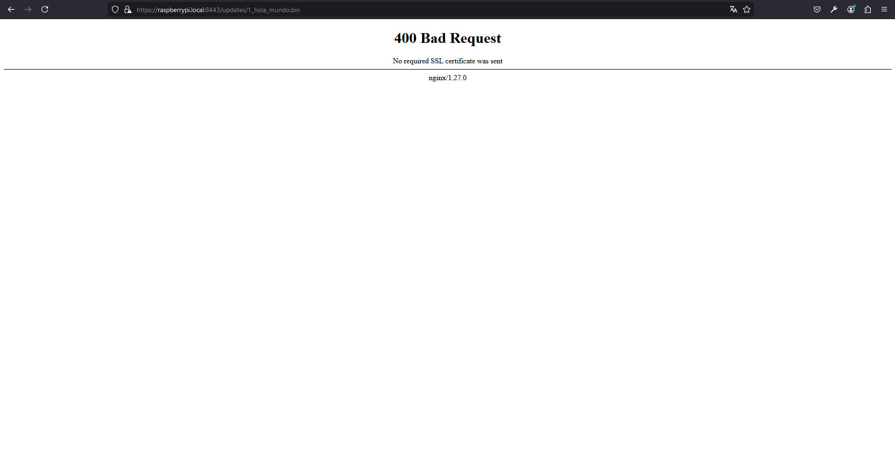
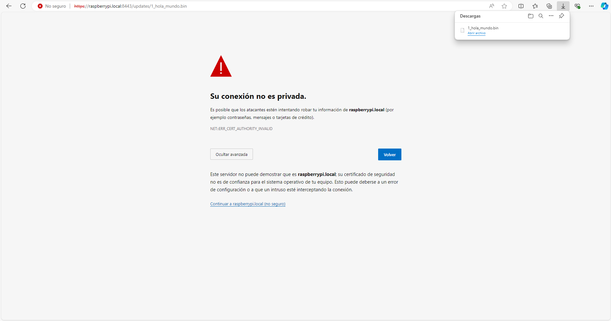
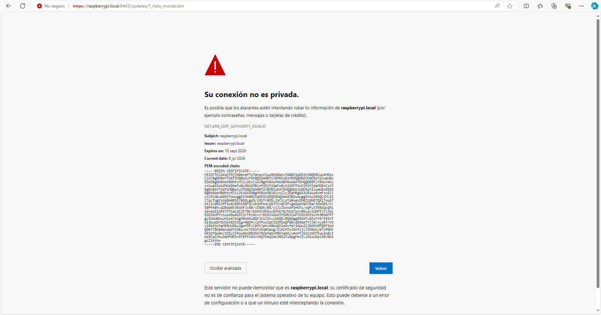

# Capitulo 10: Ngnix Https y Docker

## Crear el archivo nginx.conf para Nginx con HTTPS

1. Ejecutar `cd iot-platform`.
2. Ejecutar `mkdir nginx`.
3. Ejecutar `cd nginx`.
4. Ejecutar `mkdir config`.
5. Ejecutar `cd config`.
6. Ejecutar `touch nginx.conf`.
7. Modificar el contenido de `nginx.conf`:

```
user  nginx;
worker_processes  auto;

error_log  /var/log/nginx/error.log notice;
pid        /var/run/nginx.pid;


events {
    worker_connections  1024;
}


http {
    include       /etc/nginx/mime.types;
    default_type  application/octet-stream;

    log_format  main  '$remote_addr - $remote_user [$time_local] "$request" '
                      '$status $body_bytes_sent "$http_referer" '
                      '"$http_user_agent" "$http_x_forwarded_for"';

    access_log  /var/log/nginx/access.log  main;

    sendfile        on;
    #tcp_nopush     on;

    keepalive_timeout  65;

    #gzip  on;

    #HTTP server
    #server {
    #    listen 8080;
    #    server_name localhost;
    #
    #    location / {
    #        root /usr/share/nginx/html;
    #    }
    #
    #}

    # HTTPS server
    
    server {
        listen       8443 ssl;
        server_name  raspberry.local;

        ssl_certificate      /etc/nginx/certs/server.crt;
        ssl_certificate_key  /etc/nginx/certs/server.key;

        ssl_protocols       TLSv1 TLSv1.1 TLSv1.2 TLSv1.3;
        ssl_ciphers         HIGH:!aNULL:!MD5;

        location / {
            root /usr/share/nginx/html;
        }
    }

    #include /etc/nginx/conf.d/*.conf;
}
```

En los siguientes sitios, esta la documentacion:

[Beginner’s Guide](http://nginx.org/en/docs/beginners_guide.html)

[Configuring HTTPS servers](http://nginx.org/en/docs/http/configuring_https_servers.html)

## Copiar los certificados y llaves para Nginx con HTTPS

1. Ejecutar `mkdir certs`.
2. Ejecutar `cd certs`.
3. Ejecutar `cp ../../../mosquitto/config/certs/server.crt ./`.
4. Ejecutar `cp ../../../mosquitto/config/certs/server.key ./`

## Crear el archivo Dockerfile para generar la imagen de Nginx con HTTPS

1. Ejecutar `cd ..`.
2. Ejecutar `cd ..`.
3. Ejecutar `touch Dockerfile`.
4. Modificar el contenido de `Dockerfile`:

```
FROM nginx:latest
COPY ./config/certs/server.crt /etc/nginx/certs/server.crt
COPY ./config/certs/server.key /etc/nginx/certs/server.key
COPY ./config/nginx.conf /etc/nginx/nginx.conf
COPY ./updates /usr/share/nginx/html/updates
EXPOSE 8443
```

En el siguiente sitio, esta la documentacion:

[Dockerfile reference](https://docs.docker.com/reference/dockerfile/)

## Crear el contenido estatico para Nginx con HTTPS

1. Ejecutar `mkdir updates`.
2. Copiar el archivo `1_hola_mundo.bin` del capitulo 1 a la carpeta `updates`.

## Modificar el archivo compose.yaml para generar el contenedor de Nginx con HTTPS

1. Ejecutar `cd ..`.
2. Modificar el contenido de `compose.yaml`:

```
services:
  mosquitto:
    build: mosquitto
    container_name: mosquitto
    expose:
      - "8883"
    ports:
      - "8883:8883"
  
  nginx:
    build: nginx
    container_name: nginx
    expose:
      - "8443"
    ports:
      - "8443:8443"
```

3. Ejecutar `docker compose up --build`.

En el siguiente sitio, esta la documentacion:

[Docker Compose Quickstart](https://docs.docker.com/compose/gettingstarted/)

## Probar el contenedor de Nginx con HTTPS

1. Abrir en el navegador la ruta `https://raspberrypi.local:8443/updates/1_hola_mundo.bin`.



2. Clic en `Avanzado`.
3. Clic en `Continuar a raspberrypi.local (no seguro)`.



4. Clic en `NET:ERR_CERT_AUTHORITY_INVALID`.

