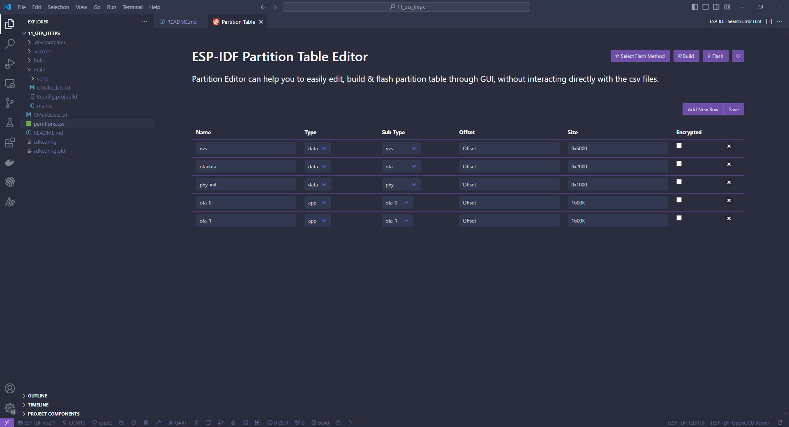
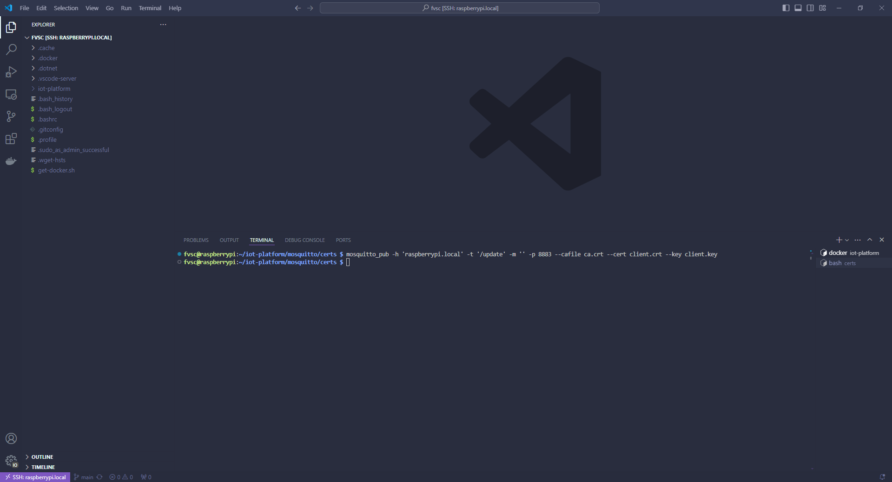
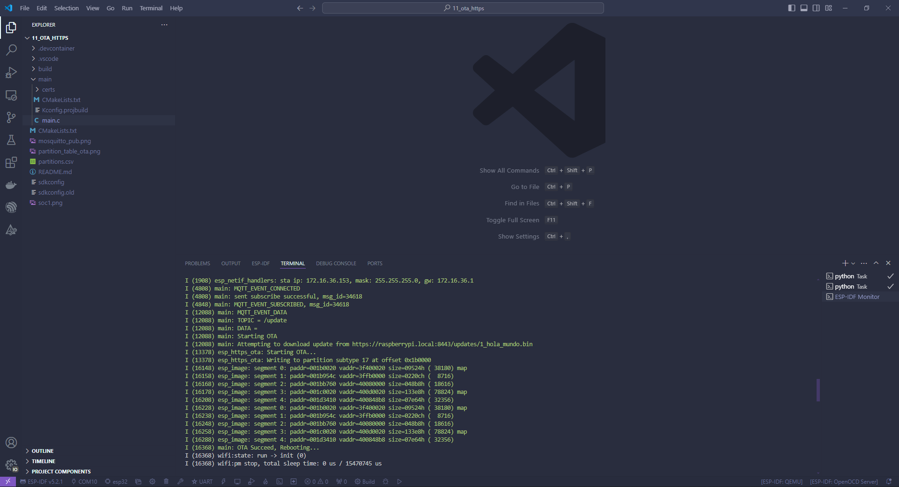
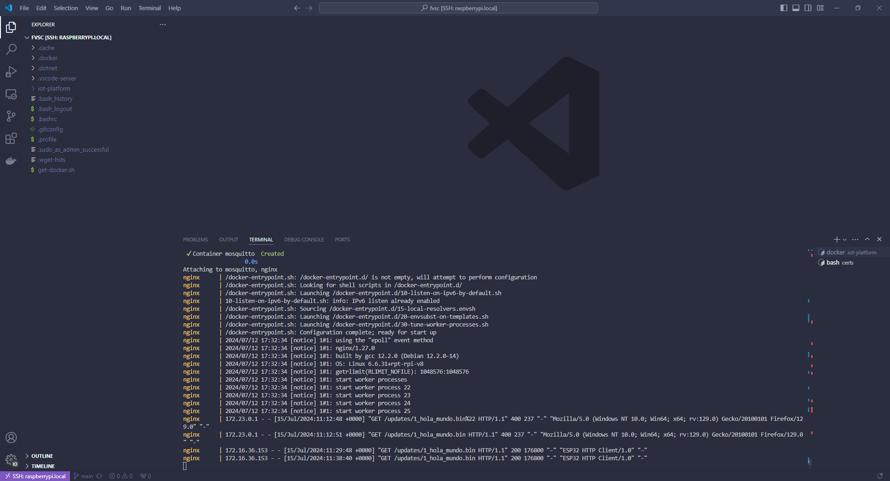
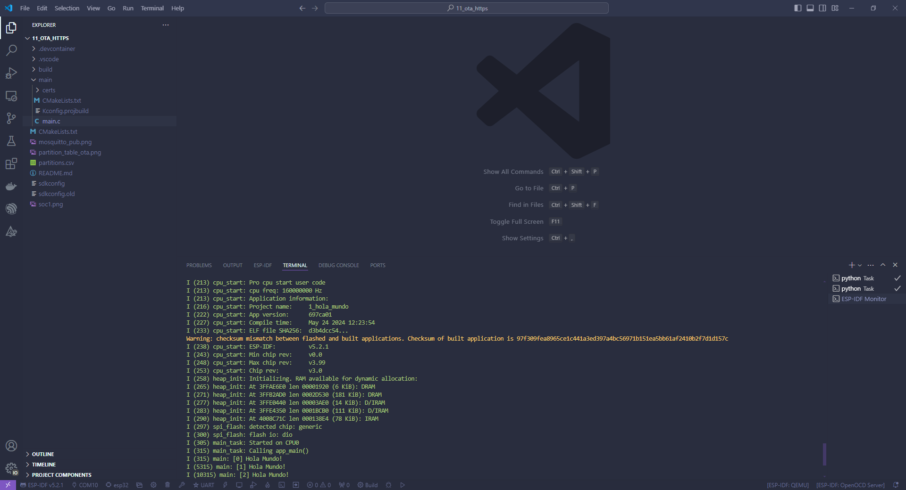

# Capitulo 11: Aplicacion con actualizacion de firmware remota

## Introduccion

Cuando compilamos un programa, se crea un archivo dentro de la carpeta `build` que tiene el mismo nombre del proyecto y la extension `.bin`. Este archivo, es el que grababamos a traves de la conexion USB.

El mecanismo OTA le permite al SOC actualizar su programa a traves de la conexion Wi-Fi o BLE.

Por lo que nuestra plataforma IoT debera:

- Tener almacenados los archivos `.bin` actualizados.
- Tener un web server estatico con protocolo HTTPS. De modo tal que al acceder a una url, se puedan descargar el archivo `.bin` correspondiente. Esto, ya fue hecho en la Raspberry Pi con Nginx.

En este capitulo:

- El mosquitto_pub hara de cliente MQTT para publicar un mensaje de actualizacion a Mosquitto.
- El SOC esperara a la llegada del mismo para iniciar el mecanismo OTA.
- El SOC hara el mecanismo OTA y descargara el programa `1_hola_mundo.bin` del web server estatico con protocolo HTTPS.

En los siguientes sitios, esta la documentacion:

[ESP HTTPS OTA](https://docs.espressif.com/projects/esp-idf/en/stable/esp32/api-reference/system/esp_https_ota.html)

[Over The Air Updates (OTA)](https://docs.espressif.com/projects/esp-idf/en/stable/esp32/api-reference/system/ota.html)

[Simple OTA example](https://github.com/espressif/esp-idf/tree/v5.2.2/examples/system/ota/simple_ota_example)

## Modificar la tabla de particiones de la memoria flash

Para poder implementar el mecanismo OTA es necesario cambiar el esquema de particionado de la memoria flash.

1. Ejecutar `ESP-IDF: SDK Configuration Editor (menuconfig)`.
2. Click en `Partition Table`.
3. En `Partition Table` seleccionar `Custom partition table CSV`.
4. Click en `Save`.
5. Presionar `CTRL+SHIFT+P`.
6. Seleccionar `ESP-IDF: Open Partition Table Editor UI`.
7. Crear el siguiente esquema de particionado:



8. Click en `Save`.
9. Abrir el archivo `partitions.csv`.

```
# ESP-IDF Partition Table
# Name, Type, SubType, Offset, Size, Flags
nvs,data,nvs,,0x6000,,
otadata,data,ota,,0x2000,,
phy_init,data,phy,,0x1000,,
ota_0,app,ota_0,,1600K,,
ota_1,app,ota_1,,1600K,,

```

10. Ejecutar `ESP-IDF: Build Project`.

En los siguientes sitios, esta la documentacion:

[Firmware Upgrades](https://docs.espressif.com/projects/esp-jumpstart/en/latest/firmwareupgrade.html)

[Partition Tables](https://docs.espressif.com/projects/esp-idf/en/latest/esp32/api-guides/partition-tables.html)

## Probar el mecanismo OTA

1. Abrir una nueva terminal en la Raspberry Pi.
2. Ejecutar `cd iot-platform`.
3. Ejecutar `cd mosquitto`.
4. Ejecutar `cd certs`.
5. Ejecutar `mosquitto_pub -h 'raspberrypi.local' -t '/update' -m '' -p 8883 --cafile ca.crt --cert client.crt --key client.key`.








