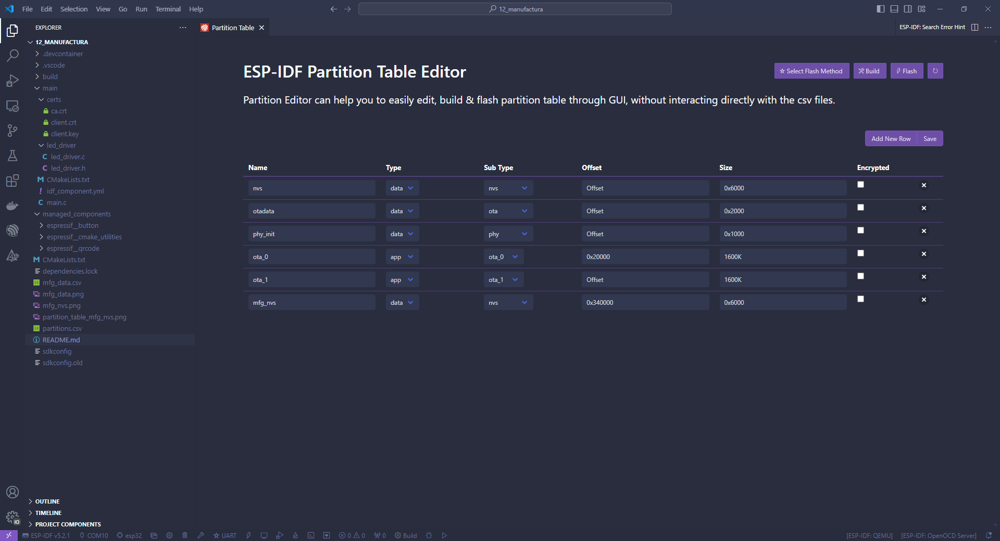
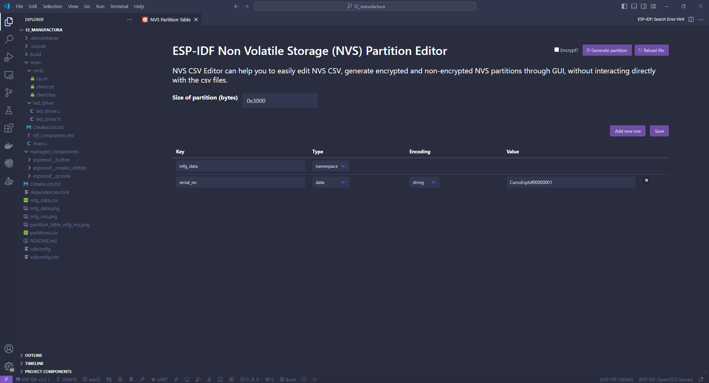
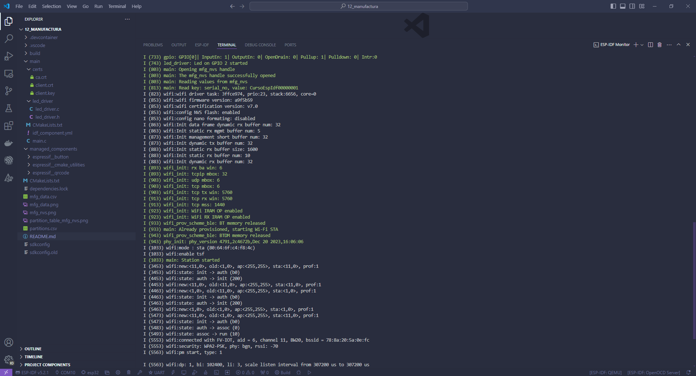
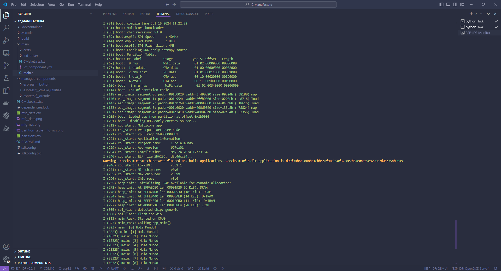

# Capitulo 12: Aplicacion pensada para la manufactura

## Introduccion

Siempre es necesario cargarle al SOC datos de fabrica, como por ejemplo un numero de serie.

Estos datos no deben ser afectados al realizar una actualizacion remota mediante el mecanismo OTA.

Como solucion, se recomienda crear una segunda particion del tipo `nvs` que contenga solo los datos de fabrica.

Otra funcionalidad importante, es tener un boton que haga un `factory reset` al mantenerlo presionado durante un tiempo prolongado. La misma, consiste en borrar las credenciales de la conexion Wi-Fi recibidas por BLE.

En los siguientes sitios, esta la documentacion:

[NVS Partition Image Generation on Build Example](https://github.com/espressif/esp-idf/tree/master/examples/storage/nvsgen)

[Wi-Fi Provisioning Manager Example](https://github.com/espressif/esp-idf/tree/master/examples/provisioning/wifi_prov_mgr)

## Modificar la tabla de particiones de la memoria flash

1. Ejecutar `ESP-IDF: SDK Configuration Editor (menuconfig)`.
2. Click en `Partition Table`.
3. En Partition Table seleccionar `Custom partition table CSV`.
4. Click en `Save`.
5. Presionar `CTRL+SHIFT+P`.
6. Seleccionar `ESP-IDF: Open Partition Table Editor UI`.
7. Crear el siguiente esquema de particionado:



8. Click en `Save`.
9. Abrir el archivo `partitions.csv`.

```
# ESP-IDF Partition Table
# Name, Type, SubType, Offset, Size, Flags
nvs,data,nvs,,0x6000,,
otadata,data,ota,,0x2000,,
phy_init,data,phy,,0x1000,,
ota_0,app,ota_0,0x20000,1600K,,
ota_1,app,ota_1,,1600K,,
mfg_nvs,data,nvs,0x340000,0x6000,,

```

En el siguiente sitio, esta la documentacion:

[Partition Tables](https://docs.espressif.com/projects/esp-idf/en/latest/esp32/api-guides/partition-tables.html)

## Crear el archivo csv para generar la particion con los datos de fabrica

1. Presionar `CTRL+SHIFT+P`.
2. Seleccionar `Open NVS Partition Editor`.
3. Ingresar `mfg_data.csv`.
4. Presionar `ENTER`.
5. Crear los siguientes datos de fabrica:



6. Click en `Save`.
7. Abrir el archivo `mfg_data.csv`.

```
key,type,encoding,value
mfg_data,namespace,,
serial_no,data,string,CursoEspIdf00000001

```

En los siguientes sitios, esta la documentacion:

[NVS Partition Generator Utility](https://docs.espressif.com/projects/esp-idf/en/latest/esp32/api-reference/storage/nvs_partition_gen.html)

[NVS Partition Editor](https://github.com/espressif/vscode-esp-idf-extension/blob/master/docs/tutorial/nvs_partition_editor.md)

## Crear y grabar de la particion con los datos de fabrica junto a la aplicacion

1. Abrir el archivo `CMakeLists.txt` que esta en la carpeta `main`.
2. Modificar su contenido a:

```
idf_component_register(
    SRCS
        "main.c"
    INCLUDE_DIRS
        "."
)

nvs_create_partition_image(mfg_nvs ../mfg_data.csv FLASH_IN_PROJECT)
```

3. Ejecutar `ESP-IDF: Build, Flash and Monitor`.





En el siguiente sitio, esta la documentacion:

[NVS o Non-Volatile Storage Library](https://docs.espressif.com/projects/esp-idf/en/stable/esp32/api-reference/storage/nvs_flash.html)
