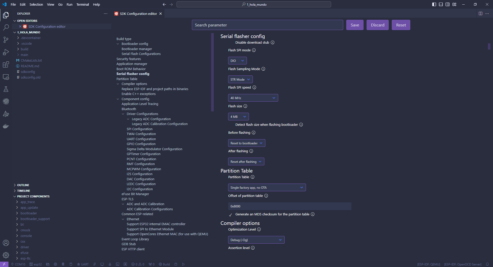

# Capitulo 1: Aplicacion Hola Mundo

## Introduccion

El framework ESP-IDF esta formado por components. Los mismos, tienen una API para que los podamos utilizar.

En este capitulo, utilizaremos el component de logging:

[Logging library](https://docs.espressif.com/projects/esp-idf/en/stable/esp32/api-reference/system/log.html)

## ESP-IDF: SDK Configuration Editor (menuconfig)

Aqui, se configura el proyecto.

1. Ejecutar `ESP-IDF: SDK Configuration Editor (menuconfig)`.
2. Click en `Serial flasher config`.
3. En `Flash size` seleccionar `4 MB`.
4. Click en `Save`.
5. Ejecutar `ESP-IDF: Build Project`.

