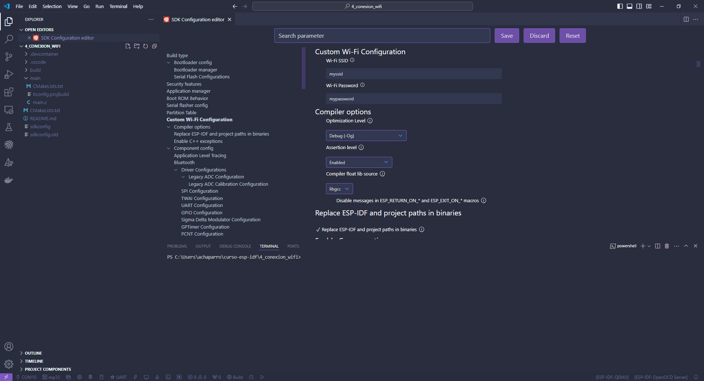

# Capitulo 4: Aplicacion que se conecta a una red Wi-Fi

## Introduccion

El driver Wi-Fi puede funcionar de 3 modos diferentes:

- En modo station o sta, que se utiliza cuando queremos conectarnos a una red Wi-Fi.
- En modo AP, o SoftAP, o access point; que se utiliza cuando queremos crear una red Wi-Fi para que otros dispositivos se conecten a nosotros.
- En modo AP/sta, donde coexisten los dos anteriores.

En los siguientes sitios, esta la documantacion y los ejemplos:

[Wi-Fi](https://docs.espressif.com/projects/esp-idf/en/stable/esp32/api-reference/network/esp_wifi.html)

[Wi-Fi Driver](https://docs.espressif.com/projects/esp-idf/en/stable/esp32/api-guides/wifi.html)

[Wi-Fi Station Example](https://github.com/espressif/esp-idf/tree/master/examples/wifi/getting_started/station)

[Wi-Fi SoftAP Example](https://github.com/espressif/esp-idf/tree/master/examples/wifi/getting_started/softAP)

[Wi-Fi SoftAP & Station Example](https://github.com/espressif/esp-idf/tree/master/examples/wifi/softap_sta)

## Agregar un menu de configuracion al proyecto en el ESP-IDF: SDK Configuration Editor (menuconfig)

Esto se hace, para no tener que modificar el codigo cuando se necesite cambiar el valor de algunas constantes. Como por ejemplo, las credenciales de la red Wi-Fi a la que nos vamos a conectar.

1. Dentro de la carpeta `main`, crear un archivo llamado `Kconfig.projbuild`.
2. Abrir el archivo `Kconfig.projbuild`.
3. Modificar su contenido a:

```
menu "Custom Wi-Fi Configuration"

    config WIFI_SSID
        string "Wi-Fi SSID"
        default "myssid"
        help
            SSID (network name) for the application to connect to.

    config WIFI_PASSWORD
        string "Wi-Fi Password"
        default "mypassword"
        help
            WiFi password (WPA or WPA2) for the application to use.

endmenu
```

4. Ejecutar `ESP-IDF: Build Project`.
5. Cerrar el VCS.
6. Volver a abrir el VCS.
7. Ejecutar `ESP-IDF: SDK Configuration Editor (menuconfig)`.



8. Completar el `Wi-Fi SSID`.
9. Completar el `Wi-Fi Password`.
10. Ejecutar `ESP-IDF: Build Project`.

En el siguiente sitio, esta la documentacion:

[Project Configuration](https://docs.espressif.com/projects/esp-idf/en/latest/esp32/api-reference/kconfig.html#configuration-options-reference)
