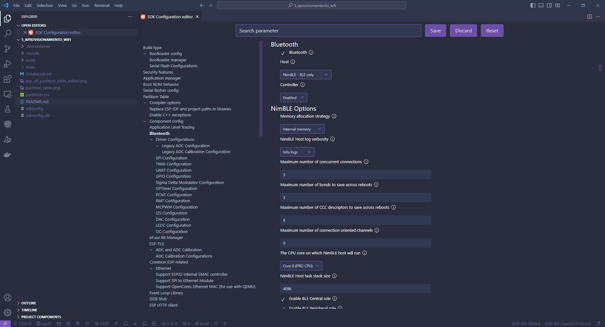
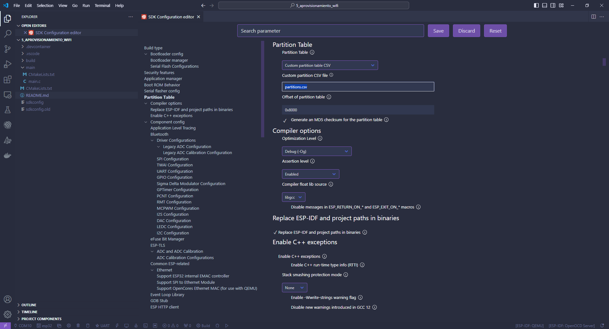
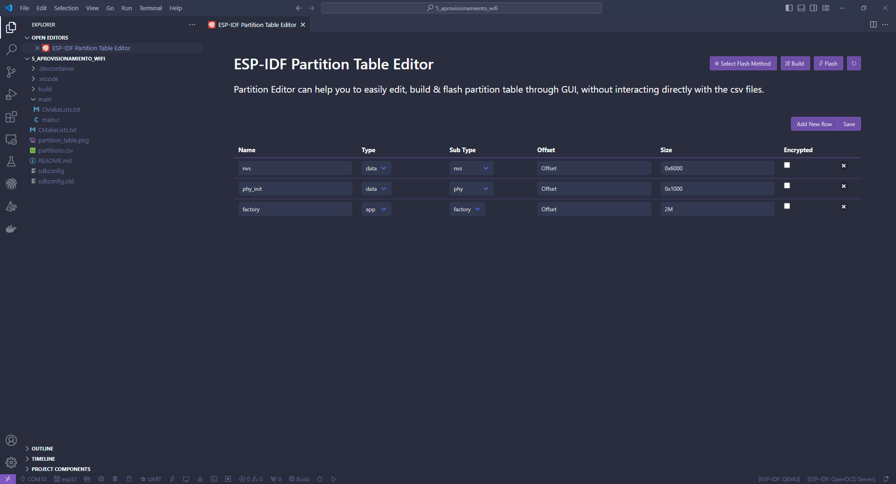
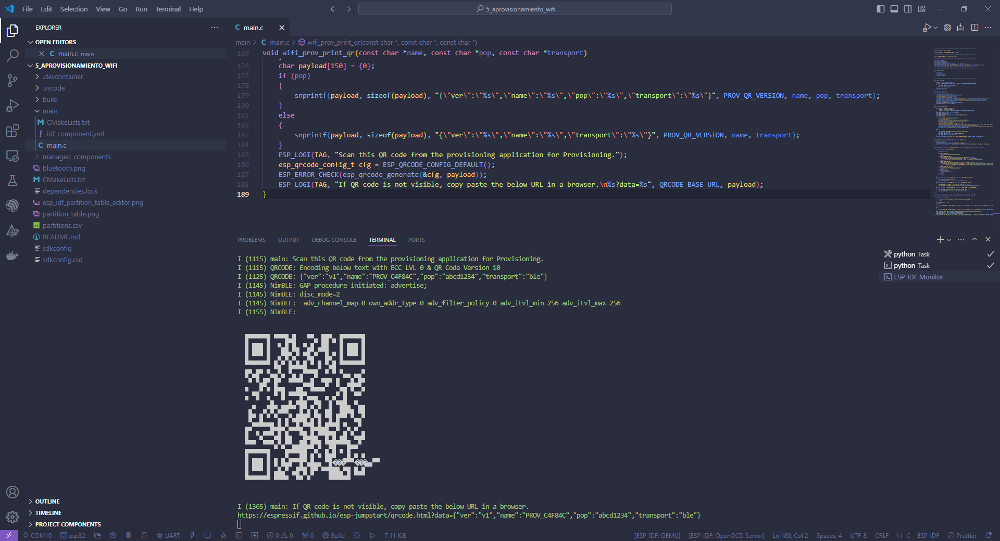
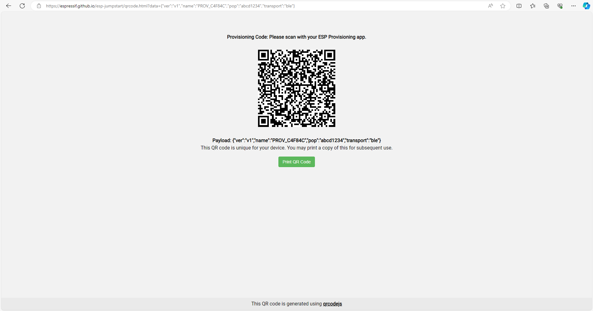

# Capitulo 5: Aplicacion que recibe las credenciales de la conexion Wi-Fi por BLE

## Introduccion

Hay un problema con la aplicacion hecha en el capitulo 4, y es que las credenciales de la conexion Wi-Fi quedan hardcodeadas en el firmware. Lo cual, no sirve si le estamos dando una solucion a un usuario final.

Lo que podemos hacer, es permitirle al usuario final cargar las credenciales de la conexion Wi-Fi utilizando una aplicacion que este instalada en su celular. Las mismas, se transmitiran de forma segura y se alamacenaran en la unidad de almacenamiento no volatil o NVS. Este proceso, se llama aprovisionamiento.

Para borrar las credenciales de la conexion Wi-Fi, pasadas durante el aprovisionamiento, hacer un `Flash Erase` y volver a bajar el programa.

En los siguientes sitios, esta la documentacion asociada:

[Unified Provisioning](https://docs.espressif.com/projects/esp-idf/en/latest/esp32/api-reference/provisioning/provisioning.html)

[Wi-Fi Provisioning](https://docs.espressif.com/projects/esp-idf/en/latest/esp32/api-reference/provisioning/wifi_provisioning.html)

[Non-Volatile Storage Library](https://docs.espressif.com/projects/esp-idf/en/latest/esp32/api-reference/storage/nvs_flash.html)

## Aprovisionamiento por SoftAP

1. La interfaz Wi-Fi se pone temporalmente en modo AP.
2. El usuario final debe conectarse a nuestra red Wi-Fi.
3. El usuario final abre la aplicacion.
4. El usuario final Ingresa el `ssid` y el `password` a ser transmitidos.

Este modo de transmision, es mas confuso desde el punto de vista del usuario final. Pero no incrementa significativamente el tamaño del firmware.

## Aprovisionamiento por BLE

1. Hacemos un BLE advertisement.
2. El usuario final abre la aplicacion.
3. El usuario final ingresa el `ssid` y el `password` a ser transmitidos.

Este modo de transmision, es mas intuitivo desde el punto de vista del usuario final. Pero incrementa significativamente el tamaño del firmware.

En el siguiente sitio, hay un ejemplo de como realizar los dos tipos de aprovisionamiento:

[Wi-Fi Provisioning Manager Example](https://github.com/espressif/esp-idf/tree/003f3bb5dc7c8af8b71926b7a0118cfc503cab11/examples/provisioning/wifi_prov_mgr)

### Cambios en ESP-IDF: SDK Configuration Editor (menuconfig)

1. Ejecutar `ESP-IDF: SDK Configuration Editor (menuconfig)`.
2. Click en `Bluetooth`.
3. Marcar el checkbox `Bluetooth`.
4. En `Host` seleccionar `NimBLE - BLE Only`.
5. Click en `Save`.



## Modificar la tabla de particiones de la memoria flash

Al SOC se le graba una tabla que va desde la direccion de memoria 0x8000 hasta la 0x9000. Esta tabla, se utiliza para que el mismo pueda tener mas de una aplicacion y diferentes tipos de datos.

En este caso, necesitamos que nuestra aplicacion pueda ocupar `2 MB` en lugar de `1 MB` para poder hacer el aprovisionamiento por BLE.

1. Ejecutar `ESP-IDF: SDK Configuration Editor (menuconfig)`.
2. Click en `Partition Table`.
3. En `Partition Table` seleccionar `Custom partition table CSV`.
4. Click en `Save`.



5. Presionar `CTRL+SHIFT+P`.
6. Seleccionar `ESP-IDF: Open Partition Table Editor UI`.
7. Crear el siguiente esquema de particionado:



8. Click en `Save`.
9. Abrir el archivo `partitions.csv`.

```
# ESP-IDF Partition Table
# Name, Type, SubType, Offset, Size, Flags
nvs,data,nvs,,0x6000,,
phy_init,data,phy,,0x1000,,
factory,app,factory,,2M,,

```

10. Ejecutar `ESP-IDF: Build Project`.

En el siguiente sitio, esta la documentacion:

[Partition Tables](https://docs.espressif.com/projects/esp-idf/en/latest/esp32/api-guides/partition-tables.html)

## Component espressif/qrcode que esta en idf-extra-components

[QR Code generator component](https://components.espressif.com/components/espressif/qrcode/versions/0.1.0~2)

1. Agregarlo.
2. Dentro de la carpeta `main`, abrir el archivo `idf_component.yml`.

```
## IDF Component Manager Manifest File
dependencies:
  espressif/qrcode: "^0.1.0~2"
  ## Required IDF version
  idf:
    version: ">=4.1.0"
  # # Put list of dependencies here
  # # For components maintained by Espressif:
  # component: "~1.0.0"
  # # For 3rd party components:
  # username/component: ">=1.0.0,<2.0.0"
  # username2/component2:
  #   version: "~1.0.0"
  #   # For transient dependencies `public` flag can be set.
  #   # `public` flag doesn't have an effect dependencies of the `main` component.
  #   # All dependencies of `main` are public by default.
  #   public: true

```




