# Capitulo 6: Raspberry Pi y Docker

## Seleccionar el hardware

1. Adquirir uno de los siguientes:

- [Raspberry Pi 3 Model B+](https://www.raspberrypi.com/products/raspberry-pi-3-model-b-plus/)

- [Raspberry Pi 4](https://www.raspberrypi.com/products/raspberry-pi-4-model-b/)

2. Adquirir una fuente de alimentacion:

- [Power supply](https://www.raspberrypi.com/documentation/computers/getting-started.html#power-supply)

3. Adquirir una fuente tarjeta microSD:

- [Boot Media](https://www.raspberrypi.com/documentation/computers/getting-started.html#boot-media)

## Instalar el Raspberry Pi OS en la tarjeta microSD

1. Insertar la tarjeta microSD en la PC.
2. Descargar el [Raspberry Pi Imager](https://www.raspberrypi.com/software/).
3. Instalar el [Raspberry Pi Imager](https://www.raspberrypi.com/software/).
4. Abrir el [Raspberry Pi Imager](https://www.raspberrypi.com/software/).

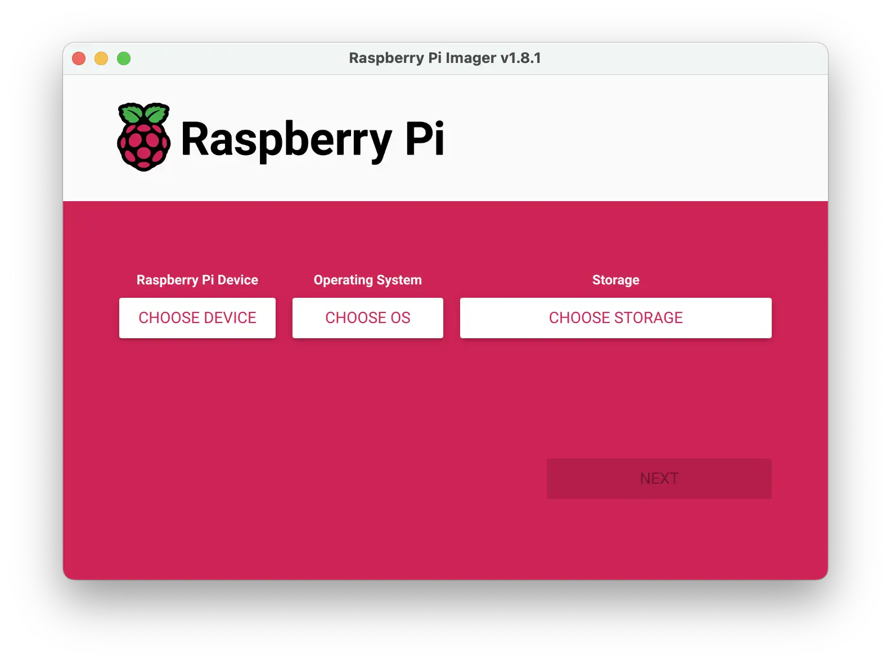

5. Click en `CHOOSE DEVICE`.
6. Seleccionar el hardware que tenemos.

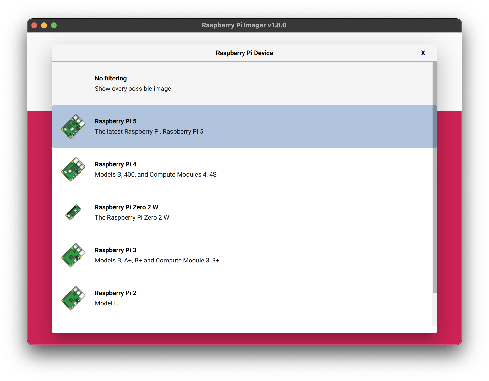

7. Click en `CHOOSE OS`.
8. Seleccionar `Raspberry Pi OS (other)`.
9. Seleccionar el `Raspberry Pi OS Lite (64-bit)`.

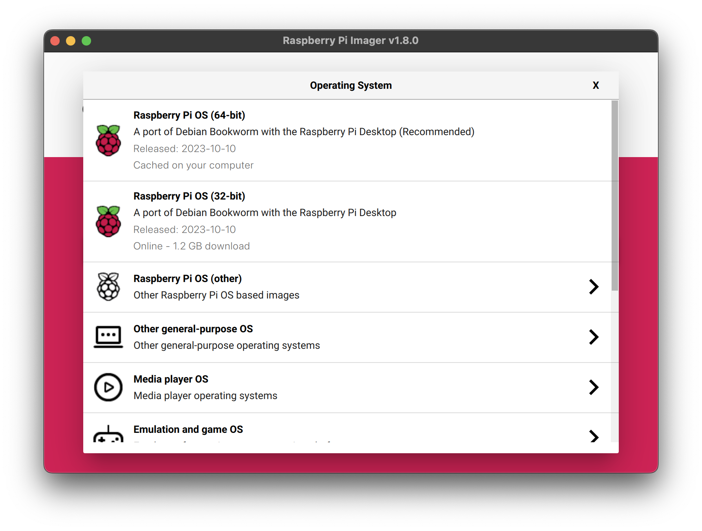

10. Click en `CHOOSE STORAGE`.
11. Seleccionar la tarjeta microSD.

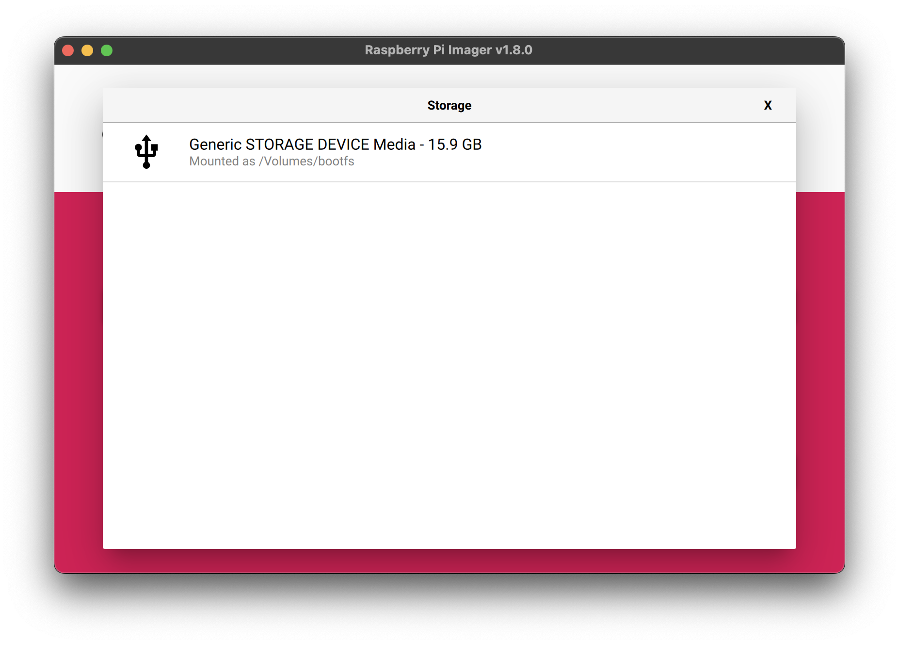

12. Click en `NEXT`.
13. Click en `EDIT SETTINGS`.

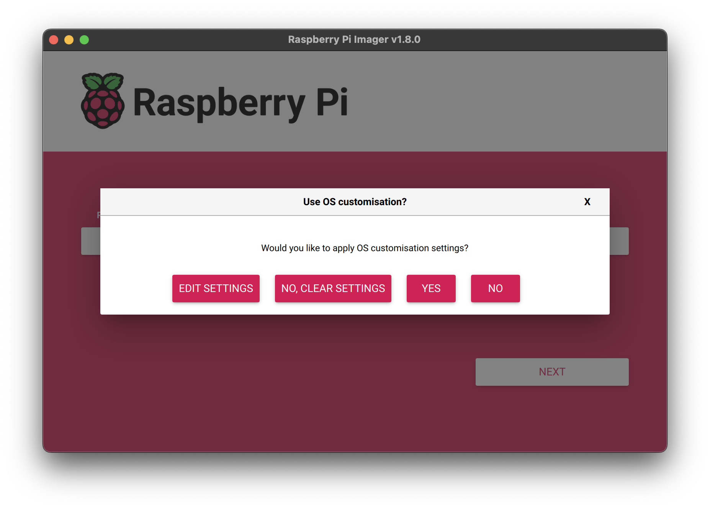

14. Marcar el checkbox `Set hostname`.
15. Completar `raspberrypi.local`.
16. Marcar el checkbox `Set username and password`.
17. Completar el `Username` para iniciar sesion.
18. Completar el `Password` para iniciar sesion.
19. Marcar el checkbox `Configure wireless LAN`.
20. Completar el `SSID` de la red Wi-Fi.
21. Completar el `Password` de la red Wi-Fi.
22. Marcar el checkbox `Set local settings`.
23. En `Time zone` seleccionar `America/Argentina`.
24. En `Keyboard layout` seleccionar `latam`.

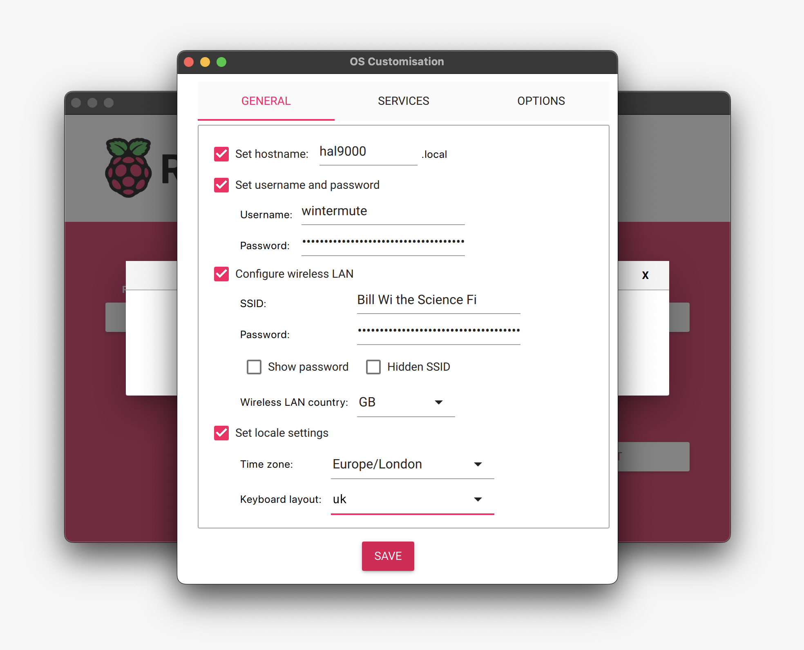

25. Click en la pestaña `SERVICES`.
26. Marcar el checkbox `Enable SSH`.
27. Marcar la opcion `Use password authentication`.
28. Click en `SAVE`.

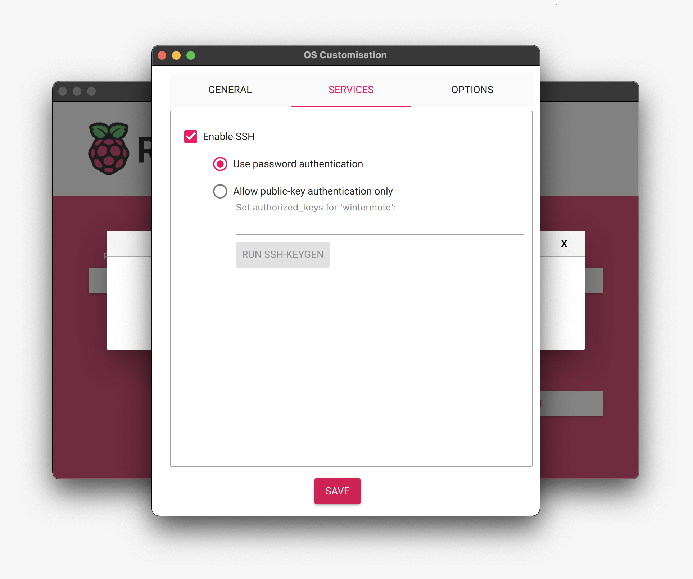

29. Click en `YES`.
30. Click en `YES`.
31. Click en `CONTINUE`.

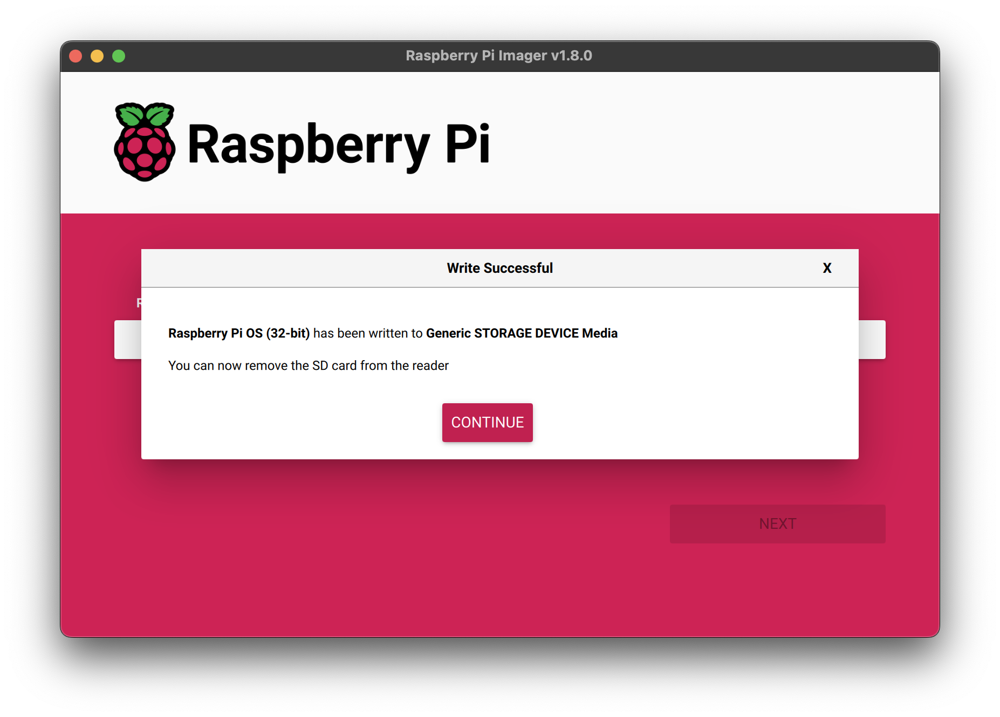

32. Quitar la tarjeta microSD en la PC.
33. Insertar la tarjeta microSD en la Raspberry Pi.
34. Conectar la fuente de alimentacion de la Raspberry Pi.

En el siguiente sitio, esta la documentacion:

[Raspberry Pi OS](https://www.raspberrypi.com/documentation/computers/getting-started.html#installing-the-operating-system)

## Acceder de forma remota a la Raspberry Pi por SSH en VCS

1. Instalar la extension `Remote - SSH` en VCS.
2. Click en `Remote Explorer`.
3. Click en `New Remote`.
4. Ingresar `ssh Username@raspberrypi.local`.
5. Presionar `ENTER`.
6. Click en `Refresh`.
7. Click en `Connect in New Window...`.
8. Seleccionar `Linux`.
9. Ingresar el `Password` cuando lo solicite.

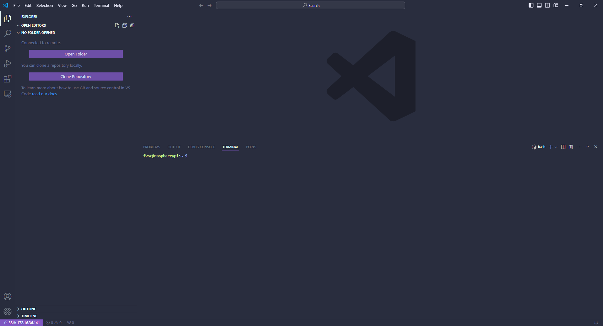

10. Click en `Open Folder`.
11. Seleccionar `Linux`.
12. Presionar `ENTER`.
13. Ingresar el `Password` cuando lo solicite.

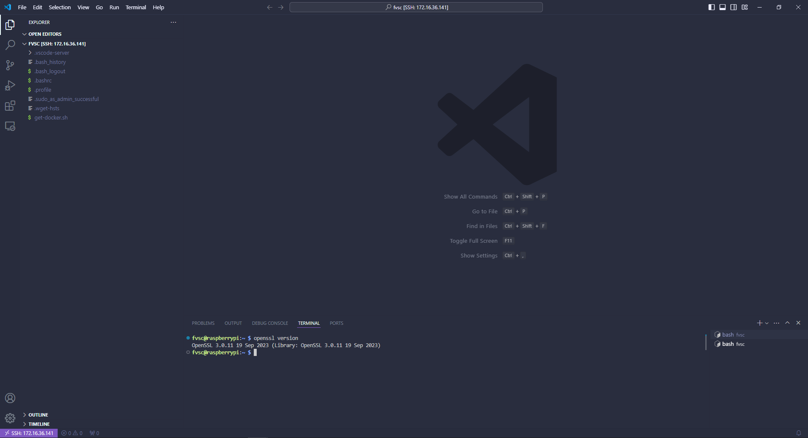

14. Abrir una terminal.
15. Ejecutar `sudo apt update`.
16. Ejecutar `sudo apt full-upgrade`.

## Instalar Docker en la Raspberry Pi

1. Ejecutar `curl -fsSL https://get.docker.com -o get-docker.sh`.
2. Ejecutar `sudo sh get-docker.sh`.
3. Ejecutar `sudo groupadd docker`.
4. Ejecutar `sudo usermod -aG docker $USER`.
5. Ejecutar `sudo gpasswd -a $USER docker`.
6. Ejecutar `sudo service docker restart`.
7. Ejecutar `sudo docker run hello-world` para verificar que Docker se instalo correctamente.

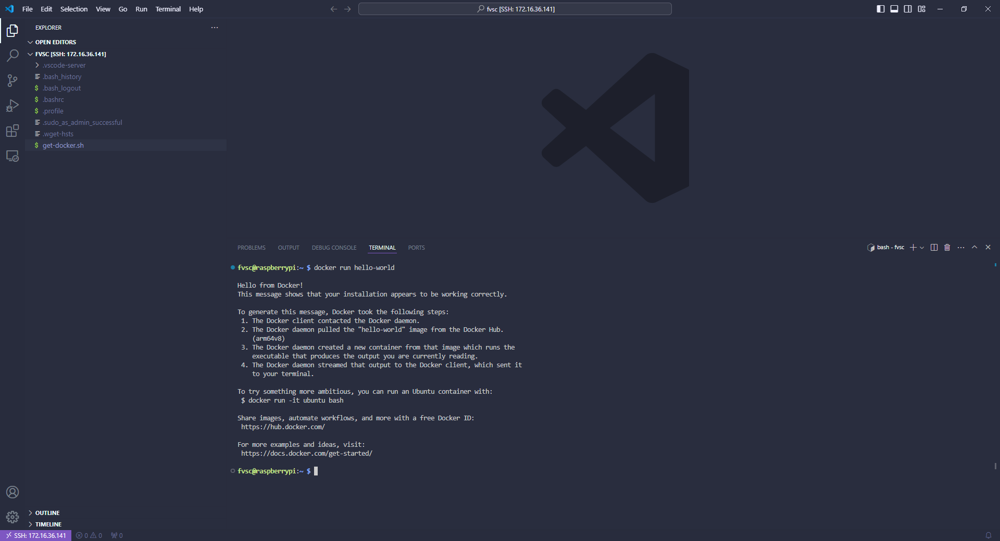

8. Ejectuar `sudo reboot`.
9. Ejecutar `docker compose version` para verificar que la herramienta Docker Compose se instalo correctamente.
10. Ejecutar `docker ps -a` para ver los datos del contenedor hello-world.
11. Ejecutar `docker rm {CONTAINER ID}` para borrar el contenedor hello-world.
12. Ejecutar `docker ps -a` para verificar que no hay ningun contenedor creado.
13. Ejecutar `docker images` para ver los datos de la imagen hello-world.
14. Ejecutar `docker rmi {IMAGE ID}` para borrar la imagen hello-world.
15. Ejectuar `docker images`para verificar que no hay ninguna imagen descargada.

En el siguiente sitio, esta la documentacion:

[Docker overview](https://docs.docker.com/get-started/overview/)
