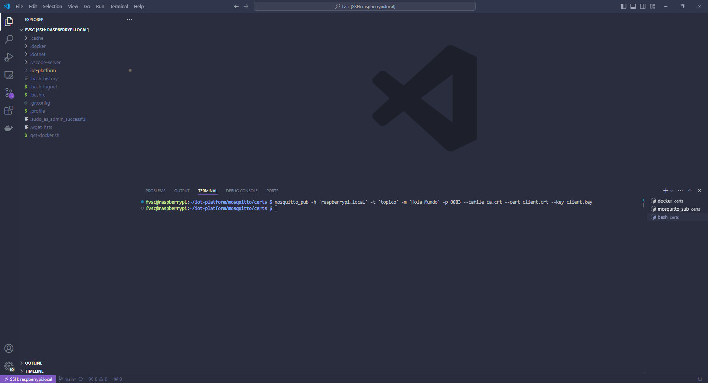

# Capitulo 7: Mosquitto con TLS y Docker

## Instalar las herramientas de Mosquitto en la Raspberry Pi

1. Ejecutar `sudo apt install mosquitto`.
2. Ejecutar `sudo apt install mosquitto-clients`.
3. Ejecutar `sudo systemctl stop mosquitto`.
4. Ejecutar `sudo systemctl disable mosquitto`.

## Crear el archivo mosquitto.conf para Mosquitto con TLS

1. Ejecutar `mkdir iot-platform`.
2. Ejecutar `cd iot-platform`.
3. Ejecutar `mkdir mosquitto`.
4. Ejecutar `cd mosquitto`.
5. Ejecutar `mkdir config`.
6. Ejecutar `cd config`.
7. Ejecutar `touch mosquitto.conf`.
8. Modificar el contenido de `mosquitto.conf`:

```
# =================================================================
# Listeners
# =================================================================

listener 8883

# -----------------------------------------------------------------
# Certificate based SSL/TLS support
# -----------------------------------------------------------------

certfile /mosquitto/config/certs/server.crt
keyfile /mosquitto/config/certs/server.key
cafile /mosquitto/config/certs/ca.crt
require_certificate true
use_identity_as_username true

# =================================================================
# Persistence
# =================================================================

persistence true
persistence_location /mosquitto/data/

# =================================================================
# Logging
# =================================================================

log_dest file /mosquitto/log/mosquitto.log
```

En el siguiente sitio, esta la documentacion:

[mosquitto.conf man page](https://mosquitto.org/man/mosquitto-conf-5.html)

## Crear los certificados y llaves para Mosquitto con TLS

1. Ejecutar `mkdir certs`.
2. Ejecutar `cd certs`.
3. Ejecutar `touch crearTLS.sh`.
4. Ejecutar `chmod +x crearTLS.sh`.
5. Modificar el contenido de `crearTLS.sh`:

```
#!/bin/bash

HOSTNAME="raspberrypi.local"
SUBJECT_CA="/C=AR/ST=Buenos Aires/L=Pilar/O=FVSA/OU=CA/CN=$HOSTNAME"
SUBJECT_SERVER="/C=AR/ST=Buenos Aires/L=Pilar/O=FVSA/OU=Server/CN=$HOSTNAME"
SUBJECT_CLIENT="/C=AR/ST=Buenos Aires/L=Pilar/O=FVSA/OU=Client/CN=$HOSTNAME"

function generate_CA () {
    echo "$SUBJECT_CA"
    openssl req -x509 -nodes -sha256 -newkey rsa:2048 -subj "$SUBJECT_CA"  -days 825 -keyout ca.key -out ca.crt
    openssl x509 -in ca.crt -text -noout
}

function generate_server () {
    echo "$SUBJECT_SERVER"
    openssl req -nodes -sha256 -new -subj "$SUBJECT_SERVER" -keyout server.key -out server.csr
    openssl x509 -req -sha256 -in server.csr -CA ca.crt -CAkey ca.key -CAcreateserial -out server.crt -days 825
    openssl x509 -in server.crt -text -noout
    openssl verify -CAfile ca.crt server.crt
}

function generate_client () {
    echo "$SUBJECT_CLIENT"
    openssl req -new -nodes -sha256 -subj "$SUBJECT_CLIENT" -out client.csr -keyout client.key
    openssl x509 -req -sha256 -in client.csr -CA ca.crt -CAkey ca.key -CAcreateserial -out client.crt -days 825
    openssl x509 -in client.crt -text -noout
    openssl verify -CAfile ca.crt client.crt
}

generate_CA
generate_server
generate_client
```

6. Ejecutar `./crearTLS.sh`.

## Crear el archivo Dockerfile para generar la imagen de Mosquitto con TLS

1. Ejecutar `cd ..`.
2. Ejecutar `cd ..`.
3. Ejecutar `touch Dockerfile`.
4. Modificar el contenido de `Dockerfile`:

```
FROM eclipse-mosquitto:latest
COPY ./config/mosquitto.conf /mosquitto/config/mosquitto.conf
COPY ./config/certs/server.crt /mosquitto/config/certs/server.crt
COPY ./config/certs/server.key /mosquitto/config/certs/server.key
COPY ./config/certs/ca.crt /mosquitto/config/certs/ca.crt
EXPOSE 8883
```

En el siguiente sitio, esta la documentacion:

[Dockerfile reference](https://docs.docker.com/reference/dockerfile/)

## Crear el archivo compose.yaml para generar el contenedor de Mosquitto con TLS

1. Ejecutar `cd ..`.
2. Ejecutar `touch compose.yaml`.
3. Modificar el contenido de `compose.yaml`:

```
services:
  mosquitto:
    build: mosquitto
    container_name: mosquitto
    expose:
      - "8883"
    ports:
      - "8883:8883"
```

4. Ejecutar `docker compose up`.

En el siguiente sitio, esta la documentacion:

[Docker Compose Quickstart](https://docs.docker.com/compose/gettingstarted/)

## Prueba del contenedor de Mosquitto con TLS

1. Abrir una nueva terminal en la Raspberry Pi.
2. Ejecutar `netstat -nap | grep 8883` para verificar que hay un servicio escuchando en el puerto 8883.
3. Ejecutar `cd iot-platform`.
4. Ejecutar `cd mosquitto`.
5. Ejecutar `cd config`.
6. Ejecutar `cd certs`.
7. Ejecutar `mosquitto_sub -h 'raspberrypi.local' -t 'topico' --cafile ca.crt -p 8883 --cert client.crt --key client.key -v`.
8. Abrir una nueva terminal en la Raspberry Pi.
9. Ejecutar `cd iot-platform`.
10. Ejecutar `cd mosquitto`.
11. Ejecutar `cd config`.
12. Ejecutar `cd certs`.
13. Ejecutar `mosquitto_pub -h 'raspberrypi.local' -t 'topico' -m 'Hola Mundo' -p 8883 --cafile ca.crt --cert client.crt --key client.key`.
14. Verificar que en la terminal que abrimos en el paso 1 aparezca el mensaje `topico Hola Mundo`.




