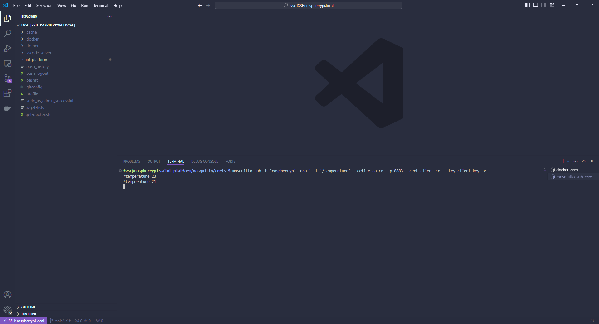

# Capitulo 8: Aplicacion con telemetria

## Introduccion

El verdadero potencial de los SOC de Espressif aparece cuando los utilizamos para:

- Enviar mediciones de forma periodica (a las que se conoce con el nombre de telemetrias) a una plataforma IoT. Como por ejemplo, la que hicimos con la Raspberry Pi.
- Recibir comandos desde una plataforma IoT, que ejecuten algun procedimiento o cambien un atributo interno.

Y para ello, necesitamos de la conectividad Wi-Fi y del protocolo MQTT. El mismo, ya fue probado en la Raspberry Pi donde:

- Mosquitto que era el servidor MQTT (o tambien llamado broker).
- Los clientes que eran las aplicaciones: mosquitto_sub, y mosquitto_pub.

Y donde vimos que los clientes pueden:

- Publicar mensajes con un determinado topico.
- Subscribirse a algun topico y esperar a que lleguen mensajes para procesarlos.

Pero, ademas de la conectividad Wi-Fi y del protocolo MQTT, se necesita de la capa de seguridad TLS que le aporta a la comunicacion:

- Integridad: los mensajes no pueden ser modificados.
- Encriptacion: los mensajes no pueden ser leidos por otros.
- Autenticacion:

1. Una CA provee un CA.crt que estara tanto en el SOC como en el servidor MQTT.
2. El SOC envia la solicitud de conexion al servidor.
3. El servidor responde con su server.crt.
4. El SOC verifica la identidad del servidor utilizando el server.crt y el CA.crt.
5. En caso afirmativo, envia su client.crt al al servidor.
6. El servidor verifica la identidad del cliente utilizando el client.crt y el CA.crt.
7. En caso afirmativo, se inician las transacciones.

En este capitulo:

- El SOC hara de cliente MQTT para publicarle mensajes a Mosquitto.
- El mosquitto_sub esperara a la llegada de los mismos para mostrarlos por la terminal de la Raspberry Pi.

En los siguientes sitios, esta la documentacion asociada:

[ESP-MQTT](https://docs.espressif.com/projects/esp-idf/en/stable/esp32/api-reference/protocols/mqtt.html)

[ESP-MQTT SSL Sample application (mutual authentication)](https://github.com/espressif/esp-idf/tree/v5.2.2/examples/protocols/mqtt/ssl_mutual_auth)

[MQTT: The Standard for IoT Messaging](https://mqtt.org/)

[Eclipse Mosquitto an open source MQTT broker](https://mosquitto.org/)

## Agregar el ca.crt, client.crt, y client.key en el firmware

1. Crear un carpeta llamada `certs` dentro de la carpeta `main`.
2. Copiar el archivo `ca.crt` de la Raspberry Pi a la carpeta `certs`.
3. Copiar el archivo `client.crt` de la Raspberry Pi a la carpeta `certs`.
4. Copiar el archivo `client.key` de la Raspberry Pi a la carpeta `certs`.
5. Abrir el archivo `CMakeLists.txt` que esta en el directorio raiz del proyecto.
6. Modificar su contenido a:

```
# For more information about build system see
# https://docs.espressif.com/projects/esp-idf/en/latest/api-guides/build-system.html
# The following five lines of boilerplate have to be in your project's
# CMakeLists in this exact order for cmake to work correctly
cmake_minimum_required(VERSION 3.16)

include($ENV{IDF_PATH}/tools/cmake/project.cmake)
project(8_telemetria)

target_add_binary_data(${CMAKE_PROJECT_NAME}.elf "main/certs/ca.crt" TEXT)
target_add_binary_data(${CMAKE_PROJECT_NAME}.elf "main/certs/client.crt" TEXT)
target_add_binary_data(${CMAKE_PROJECT_NAME}.elf "main/certs/client.key" TEXT)
```

En el siguiente sitio, esta la documentacion asociada:

[Build System](https://docs.espressif.com/projects/esp-idf/en/stable/esp32/api-guides/build-system.html)

## Probar la comunicacion

1. Abrir una nueva terminal en la Raspberry Pi.
2. Ejecutar `netstat -nap | grep 8883` para verificar que hay un servicio escuchando en el puerto 8883.
3. Ejecutar `cd iot-platform`.
4. Ejecutar `cd mosquitto`.
5. Ejecutar `cd certs`.
6. Ejecutar `mosquitto_sub -h 'raspberrypi.local' -t '/temperature' --cafile ca.crt -p 8883 --cert client.crt --key client.key -v`.


