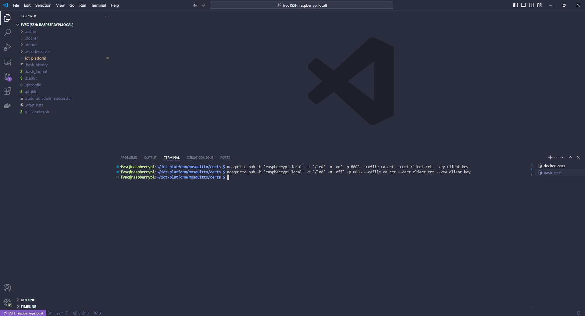

# Capitulo 9: Aplicacion con comandos remotos

## Introduccion

En este capitulo:

- El mosquitto_pub hara de cliente MQTT para publicarle mensajes a Mosquitto.
- El SOC esperara a la llegada de los mismos para encender o apagar un led.

En los siguientes sitios, esta la documentacion asociada:

[ESP-MQTT](https://docs.espressif.com/projects/esp-idf/en/stable/esp32/api-reference/protocols/mqtt.html)

[ESP-MQTT SSL Sample application (mutual authentication)](https://github.com/espressif/esp-idf/tree/v5.2.2/examples/protocols/mqtt/ssl_mutual_auth)

## Modularizar la funcionalidad del led

Modularizar implica separar en varios archivos el contenido de nuestro main.c permitiendo:

- Organizar el codigo para facilitar su comprension y mantenimiento.
- Reducir la longitud de los archivos.
- Aumentar la reutilizacion del codigo.

Asi, un modulo es un par de archivos .c y .h que resuelven una funcionalidad de nuestra aplicacion.

Y en este capitulo, se separa la funcionalidad del led del archivo main.c.

1. Crear una carpeta llamada `led_driver` dentro de la carpeta `main`.
2. Dentro de la carpeta `led_driver` crear un archivo llamado `led_driver.h`.
3. Dentro de la carpeta `led_driver` crear un archivo llamado `led_driver.c`.
4. Dentro de la carpeta `main `abrir el archivo `CMakeLists.txt`.
5. Modificar su contenido a:

```
idf_component_register(
    SRCS
        "main.c"
        "led_driver/led_driver.c"
    INCLUDE_DIRS
        "."
        "led_driver"
)
```

6. Ejecutar ESP-IDF: `Build Project`.

[Build System](https://docs.espressif.com/projects/esp-idf/en/stable/esp32/api-guides/build-system.html)

## Probar la comunicacion

1. Abrir una nueva terminal en la Raspberry Pi.
2. Ejecutar `netstat -nap | grep 8883` para verificar que hay un servicio escuchando en el puerto 8883.
3. Ejecutar `cd iot-platform`.
4. Ejecutar `cd mosquitto`.
5. Ejecutar `cd config`.
6. Ejecutar `cd certs`.
7. Ejecutar `mosquitto_pub -h 'raspberrypi.local' -t '/led' -m 'on' -p 8883 --cafile ca.crt --cert client.crt --key client.key` para encender el led.
8. Ejecutar `mosquitto_pub -h 'raspberrypi.local' -t '/led' -m 'off' -p 8883 --cafile ca.crt --cert client.crt --key client.key` para apagar el led.




